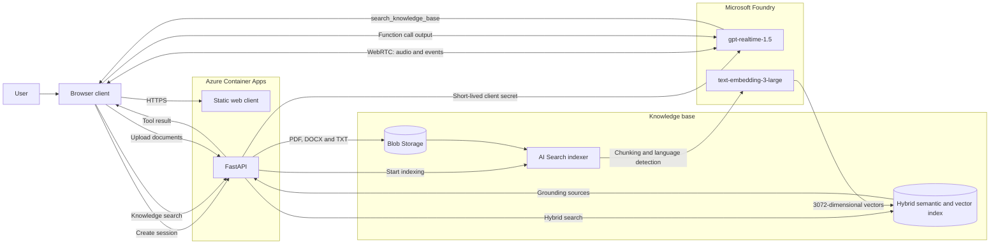

# GPT Realtime Language Lab

[Dansk version](readme_dk.md)

A small learning project for testing `gpt-realtime-1.5` with Danish and English speech and grounded answers from your own PDF, DOCX, and TXT files.

## Architecture



- The browser connects directly to GPT Realtime through WebRTC using a short-lived client secret from FastAPI.
- FastAPI uses `DefaultAzureCredential`; no Azure API keys are stored in the source code.
- Documents are stored in Blob Storage and chunked/vectorized by Azure AI Search.
- Hybrid semantic/vector search uses `text-embedding-3-large` with 3072 dimensions.
- Azure Container Apps hosts both the API and the static browser client.

`azd up` creates a dedicated Foundry resource in the selected resource group together with deployments for `gpt-realtime-1.5`, `text-embedding-3-large`, and `gpt-4o-mini-transcribe`. Deployment names and model versions can be configured through the azd environment.

## Run locally

Prerequisites:

- Python 3.12
- An Azure CLI login with access to Foundry, Search, and Storage
- The required local data-plane roles

```powershell
python -m venv .venv
.\.venv\Scripts\Activate.ps1
pip install -e ".[dev]"
Copy-Item .env.example .env
uvicorn app.main:app --reload
```

Open `http://127.0.0.1:8000`, allow microphone access, and select Auto, Dansk, or English.

The knowledge base requires values for `AZURE_SEARCH_ENDPOINT` and `AZURE_STORAGE_ACCOUNT_URL` in `.env`. The storage URL must be the account endpoint without the container name, for example `https://<account>.blob.core.windows.net`; configure the container separately with `AZURE_STORAGE_CONTAINER_NAME`. The realtime functionality can be tested separately.

## Quality checks

```powershell
.\.venv\Scripts\python.exe -m ruff check app tests scripts
.\.venv\Scripts\python.exe -m pytest
```

The manual language and retrieval matrix is available in [docs/manual-test-plan.md](docs/manual-test-plan.md).

## Azure deployment

The project uses azd, Bicep, remote ACR builds, and managed identities. During `azd up`, you are prompted to choose an existing or new resource group for the demo.

```powershell
azd auth login
azd env select realtime-dev
$clientId = azd env get-value ENTRA_CLIENT_ID
az ad app update --id $clientId --enable-id-token-issuance true
$env:AZURE_DEV_USER_AGENT = "microsoft_foundry_skill"
azd provision --no-prompt
azd deploy --no-prompt
```

ID token issuance is required by the Container Apps Easy Auth hybrid flow. Container Apps and ACR are deployed in two stages so the `AcrPull` role can propagate between provisioning and image deployment. The Search index, data source, skillset, and indexer are created idempotently by the post-provision hook.

## Security

- Runtime access uses Entra ID and managed identity.
- Local key authentication is disabled for Storage and Search.
- Raw audio is not stored.
- Uploads are limited to PDF, DOCX, and TXT files of up to 20 MB.
- `.env` and `.azure` are ignored by Git.

## Azure RBAC

### Roles provisioned by Bicep

The assignments below are the repeatable source of truth defined in `infra/main.bicep`.

| Principal | Scope | Role | Purpose |
|---|---|---|---|
| Container App user-assigned managed identity | Container Registry | `AcrPull` | Pull the application image |
| Container App user-assigned managed identity | Foundry resource | `Cognitive Services OpenAI User` | Create Realtime sessions and use deployed models |
| Container App user-assigned managed identity | Storage account | `Storage Blob Data Contributor` | List, upload, and delete knowledge documents |
| Container App user-assigned managed identity | Azure AI Search | `Search Index Data Reader` | Query the knowledge index |
| Container App user-assigned managed identity | Azure AI Search | `Search Service Contributor` | Run and inspect the Search indexer |
| Azure AI Search system-assigned managed identity | Storage account | `Storage Blob Data Reader` | Read source documents during indexing |
| Azure AI Search system-assigned managed identity | Foundry resource | `Cognitive Services OpenAI User` | Generate embeddings through the configured model deployment |
| Azure AI Search system-assigned managed identity | Foundry resource | `Cognitive Services User` | Use the AI Services enrichment skillset |
| Deploying user (`principalId`) | Azure AI Search | `Search Service Contributor` | Create and update the index, data source, skillset, and indexer |
| Deploying user (`principalId`) | Azure AI Search | `Search Index Data Reader` | Validate and query the configured index |

Container Apps Easy Auth controls end-user access to the web application separately from these Azure RBAC assignments.

### Current demo environment snapshot

Verified on **2026-09-02** in the `dbhackathon-rg` and `dbhackathon` resource groups. This is an operational snapshot and can drift; Azure and `infra/main.bicep` should be checked again after permission or deployment changes.

The current demo resources do not exactly match the Bicep topology: `dbhackathon-rg` hosts the application in App Service, while the Bicep template provisions Azure Container Apps.

| Principal | Resource/scope | Observed assignment |
|---|---|---|
| App Service managed identity for `dbvoice-live-demo-5174` | `dbvoice-openai` | `Cognitive Services OpenAI User` |
| App Service managed identity for `dbvoice-live-demo-5174` | `dbvoice-search` | `Search Index Data Reader` |
| App Service managed identity for `dbvoice-live-demo-5174` | `dbvoice5174` | `Storage Blob Data Reader` |
| App Service managed identity for `dbvoice-live-demo-5174` | `dbhackathon-rg` | `Storage Blob Data Reader` (inherited by resources in the group; duplicates the direct Storage reader assignment) |
| Two user principals, including `khyld@microsoft.com` | `dbvoice5174` | `Storage Blob Data Contributor` |
| The same two user principals | `dbvoice-search` | `Search Index Data Reader` and `Search Index Data Contributor` |
| App Service managed identity for `dbvoice-live-demo-5174` | `db-demo-foundry-resource` in `dbhackathon` | `Cognitive Services OpenAI User` |
| One additional service principal | `db-demo-foundry-resource` in `dbhackathon` | `Reader` |

No direct role assignment was observed on the App Service resource itself. The Azure AI Search managed identity exists, but no direct assignment for it was returned in this snapshot.
