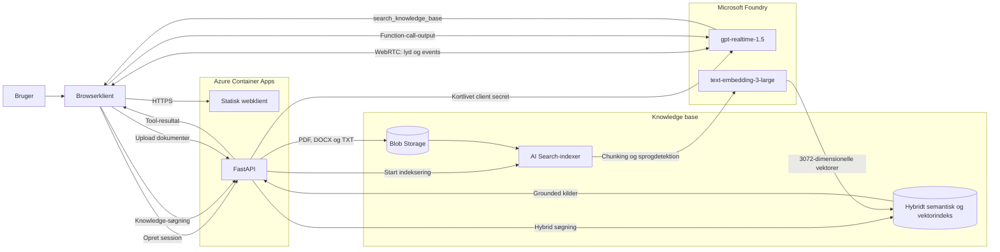

# GPT Realtime Sproglab

Et lille læringsprojekt til at teste `gpt-realtime-1.5` med dansk og engelsk tale samt grounded svar fra egne PDF-, DOCX- og TXT-filer.

## Arkitektur



- Browseren forbinder direkte til GPT Realtime med WebRTC og en kortlivet client secret fra FastAPI.
- FastAPI bruger `DefaultAzureCredential`; ingen Azure API-nøgler ligger i kildekoden.
- Dokumenter gemmes i Blob Storage og chunkes/vektoriseres af Azure AI Search.
- Hybrid semantic/vector search bruger `text-embedding-3-large` med 3072 dimensioner.
- Azure Container Apps hoster både API og den statiske browserklient.

De eksisterende deployments `gpt-realtime-1.5` og `text-embedding-3-large` på `proj-ai103-resource` genbruges.

## Lokal kørsel

Forudsætninger:

- Python 3.12
- Azure CLI-login med adgang til Foundry, Search og Storage
- De nødvendige lokale data-plane roller

```powershell
python -m venv .venv
.\.venv\Scripts\Activate.ps1
pip install -e ".[dev]"
Copy-Item .env.example .env
uvicorn app.main:app --reload
```

Åbn `http://127.0.0.1:8000`, tillad mikrofonadgang, og vælg Auto, Dansk eller English.

Knowledge base kræver værdier for `AZURE_SEARCH_ENDPOINT` og `AZURE_STORAGE_ACCOUNT_URL` i `.env`. Realtime-delen kan testes separat.

## Kvalitetschecks

```powershell
.\.venv\Scripts\python.exe -m ruff check app tests scripts
.\.venv\Scripts\python.exe -m pytest
```

Den manuelle sprog- og retrievalmatrix findes i [docs/manual-test-plan.md](docs/manual-test-plan.md).

## Azure deployment

Projektet bruger azd, Bicep, remote ACR build og managed identities.

```powershell
azd auth login
azd env select realtime-dev
$clientId = azd env get-value ENTRA_CLIENT_ID
az ad app update --id $clientId --enable-id-token-issuance true
$env:AZURE_DEV_USER_AGENT = "microsoft_foundry_skill"
azd provision --no-prompt
azd deploy --no-prompt
```

ID-token-udstedelse er påkrævet af Container Apps Easy Auths hybrid-flow. Container Apps og ACR deployes i to trin, så `AcrPull`-rollen kan propagere mellem provisionering og image-deployment. Search index, data source, skillset og indexer oprettes idempotent af post-provision-hooken.

## Sikkerhed

- Runtime-adgang bruger Entra ID og managed identity.
- Storage og Search har lokal nøgleauth deaktiveret.
- Rå lyd gemmes ikke.
- Uploads er begrænset til PDF, DOCX og TXT på højst 20 MB.
- `.env` og `.azure` er ignoreret af Git.

`learning.py` er det oprindelige Python-læringsscript og er ikke en del af webappen.
