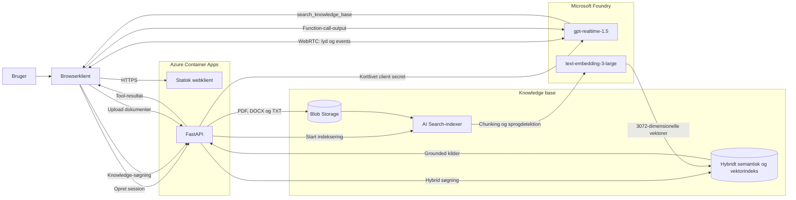

# GPT Realtime Sproglab

[English version](readme.md)

Et lille læringsprojekt til at teste `gpt-realtime-1.5` med dansk og engelsk tale samt grounded svar fra egne PDF-, DOCX- og TXT-filer.

## Arkitektur



- Browseren forbinder direkte til GPT Realtime med WebRTC og en kortlivet client secret fra FastAPI.
- FastAPI bruger `DefaultAzureCredential`; ingen Azure API-nøgler ligger i kildekoden.
- Dokumenter gemmes i Blob Storage og chunkes/vektoriseres af Azure AI Search.
- Hybrid semantic/vector search bruger `text-embedding-3-large` med 3072 dimensioner.
- Azure Container Apps hoster både API og den statiske browserklient.

`azd up` opretter en dedikeret Foundry-ressource i den valgte resource group sammen med deployments til `gpt-realtime-1.5`, `text-embedding-3-large` og `gpt-4o-mini-transcribe`. Deploymentnavne og modelversioner kan konfigureres via azd-miljøet.

## Lokal kørsel

Forudsætninger:

- Python 3.12
- Azure CLI-login med adgang til Foundry, Search og Storage
- De nødvendige lokale data-plane roller

```powershell
python -m venv .venv
.\.venv\Scripts\Activate.ps1
pip install -e ".[dev]"
Copy-Item .env.example .env
uvicorn app.main:app --reload
```

Åbn `http://127.0.0.1:8000`, tillad mikrofonadgang, og vælg Auto, Dansk eller English.

Knowledge base kræver værdier for `AZURE_SEARCH_ENDPOINT` og `AZURE_STORAGE_ACCOUNT_URL` i `.env`. Storage-URL'en skal være konto-endpointet uden containernavnet, f.eks. `https://<konto>.blob.core.windows.net`; containeren konfigureres separat med `AZURE_STORAGE_CONTAINER_NAME`. Realtime-delen kan testes separat.

## Kvalitetschecks

```powershell
.\.venv\Scripts\python.exe -m ruff check app tests scripts
.\.venv\Scripts\python.exe -m pytest
```

Den manuelle sprog- og retrievalmatrix findes i [docs/manual-test-plan.md](docs/manual-test-plan.md).

## Azure deployment

Projektet bruger azd, Bicep, remote ACR build og managed identities. Under `azd up` bliver du spurgt, hvilken eksisterende eller ny resource group demoen skal installeres i.

```powershell
azd auth login
azd env select realtime-dev
$clientId = azd env get-value ENTRA_CLIENT_ID
az ad app update --id $clientId --enable-id-token-issuance true
$env:AZURE_DEV_USER_AGENT = "microsoft_foundry_skill"
azd provision --no-prompt
azd deploy --no-prompt
```

ID-token-udstedelse er påkrævet af Container Apps Easy Auths hybrid-flow. Container Apps og ACR deployes i to trin, så `AcrPull`-rollen kan propagere mellem provisionering og image-deployment. Search index, data source, skillset og indexer oprettes idempotent af post-provision-hooken.

## Sikkerhed

- Runtime-adgang bruger Entra ID og managed identity.
- Storage og Search har lokal nøgleauth deaktiveret.
- Rå lyd gemmes ikke.
- Uploads er begrænset til PDF, DOCX og TXT på højst 20 MB.
- `.env` og `.azure` er ignoreret af Git.

## Azure RBAC

### Roller provisioneret af Bicep

Tildelingerne nedenfor er den reproducerbare source of truth, som er defineret i `infra/main.bicep`.

| Principal | Scope | Rolle | Formål |
|---|---|---|---|
| Container Apps user-assigned managed identity | Container Registry | `AcrPull` | Hente applikationens container-image |
| Container Apps user-assigned managed identity | Foundry-resource | `Cognitive Services OpenAI User` | Oprette Realtime-sessioner og bruge deployerede modeller |
| Container Apps user-assigned managed identity | Storage account | `Storage Blob Data Contributor` | Liste, uploade og slette knowledge-dokumenter |
| Container Apps user-assigned managed identity | Azure AI Search | `Search Index Data Reader` | Søge i knowledge-indekset |
| Container Apps user-assigned managed identity | Azure AI Search | `Search Service Contributor` | Starte og aflæse Search-indexeren |
| Azure AI Search system-assigned managed identity | Storage account | `Storage Blob Data Reader` | Læse kildedokumenter under indeksering |
| Azure AI Search system-assigned managed identity | Foundry-resource | `Cognitive Services OpenAI User` | Generere embeddings med den konfigurerede modeldeployment |
| Azure AI Search system-assigned managed identity | Foundry-resource | `Cognitive Services User` | Bruge AI Services enrichment-skillsettet |
| Brugeren der deployer (`principalId`) | Azure AI Search | `Search Service Contributor` | Oprette og opdatere index, data source, skillset og indexer |
| Brugeren der deployer (`principalId`) | Azure AI Search | `Search Index Data Reader` | Validere og søge i det konfigurerede index |

Container Apps Easy Auth styrer slutbrugernes adgang til webapplikationen separat fra disse Azure RBAC-tildelinger.

### Krævet demo-miljø

For denne demo er den forventede Azure-kontekst:

- Tenant: `1a8f6d42-be1a-4de7-a668-2857bc39ce8a`
- Subscription: `40bfcd72-ab71-4a15-be1a-be1cff1d2498`
- Resource group: `rg-ai103`

Appen bruger `DefaultAzureCredential`, så den aktive Azure CLI-session skal være logget ind med den korrekte tenant og subscription, før realtime-sessionen kan startes. Hvis den forkerte tenant eller subscription er aktiv, kan backenden køre, men oprettelsen af realtime-sessionen vil fejle med meddelelsen: `Could not start the realtime session`.

```powershell
az login --tenant 1a8f6d42-be1a-4de7-a668-2857bc39ce8a
az account set --subscription 40bfcd72-ab71-4a15-be1a-be1cff1d2498
az account show --output table
az group show --name rg-ai103 --subscription 40bfcd72-ab71-4a15-be1a-be1cff1d2498 --output table
```

### RBAC-checkliste til demoen

Før appen prøves igen, skal du kontrollere, at den indloggede principal har de nødvendige Azure RBAC-tildelinger på ressourcerne i `rg-ai103`, især Foundry/OpenAI-ressourcen, Azure AI Search og Storage-kontoen, som demoen bruger. De konkrete rolletitler kan variere, men den aktive bruger skal kunne:

- Oprette og bruge realtime/OpenAI-sessionen
- Læse fra Azure AI Search-indekset
- Læse/skrive til den Storage-konto, som knowledge-dokumenterne ligger i
- Få adgang til de konfigurerede Foundry-deployments, som appen bruger

Hvis appen stadig fejler efter at have skiftet til den korrekte tenant og subscription, skal du først verificere den aktuelle principal og de tildelte roller på de relevante ressourcer i `rg-ai103`, før du ændrer kode.
